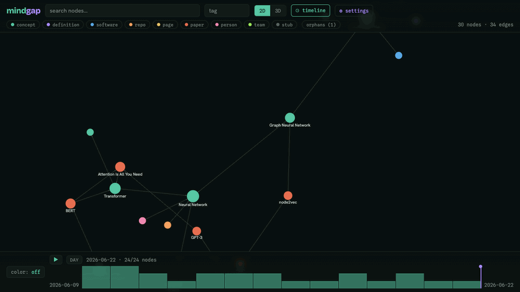
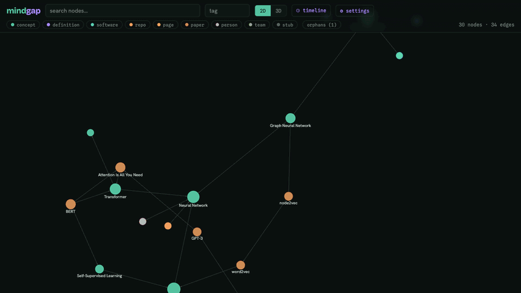

# mindgap

**Give an agent a goal and a place to remember.** It loops — reading what's known, researching, writing back evidence-linked findings — and a knowledge graph grows itself across sessions. `mindgap` is that memory: a local, org-roam-style graph for research and project knowledge (concepts, definitions, software, repos, Confluence pages, arXiv papers, people, teams) that autonomous loop sessions read *before* they work and write *after* — markdown nodes densified with `[[wiki-links]]`, every node carrying its source URLs, rendered live in 2D/3D. You can hand-curate via CLI + web UI too; the agents just never stop adding.

<p align="center"></p>

<p align="center"><sub>▶ the 20-second launch film — scattered notes bloom into a knowledge graph, then tilt into a star-field galaxy: <a href="https://github.com/grburgess/mindgap/raw/main/brag-output-2026-06-24-133017/brag.mp4">brag.mp4</a> (720p · 0.8&nbsp;MB)</sub></p>

## The idea

> *"LLMs are exceptionally good at looping until they meet specific goals. Don't tell it what to do — give it success criteria and watch it go."* — Andrej Karpathy

An agent looping toward a goal needs somewhere to look before it starts and somewhere to put what it finds. `mindgap` is that somewhere. Each session reads the relevant subgraph for context, does the work — sweep arXiv, map a repo, mine the connections for buildable ideas — then ingests new nodes and edges *with provenance*. Nothing evaporates when the context window closes: the next run builds on the last, and knowledge **compounds** instead of being re-derived. You supply the goal and the success criteria; the graph is the durable, queryable memory the loop reads and writes.

## Quickstart

    pipx install git+https://github.com/grburgess/mindgap.git
    mindgap init      # create ~/.mindgap/mindgap.db + a small demo graph
    mindgap serve     # open the web UI at http://localhost:8765

The seeded graph is just a demo to show the shape. **To start your own, clear it** — the database recreates itself empty on next use:

    rm ~/.mindgap/mindgap.db
    mindgap add --title "My first concept" --tags research   # then grow it via the CLI, the web UI, or MCP

(Don't re-run `mindgap init` after clearing — that re-seeds the demo. Or point `MINDGAP_DB` at a new path to keep the demo and start a separate graph.)


Stdlib-only Python 3.10 — no pip installs. Data lives in a single SQLite file.

## Install

Pick one. All paths put `mindgap` (and `mindgap-mcp`) on your PATH and store data in
`~/.mindgap` (override with `MINDGAP_HOME`, or `MINDGAP_DB` for just the DB file).

**pipx (recommended):**
    pipx install git+https://github.com/grburgess/mindgap.git
    mindgap init        # creates ~/.mindgap/mindgap.db and seeds it
    mindgap serve       # web UI at http://localhost:8765

**pip:**
    pip install --user git+https://github.com/grburgess/mindgap.git
    mindgap init && mindgap serve     # ensure ~/.local/bin is on PATH

**From a clone (no install / development):**
    git clone https://github.com/grburgess/mindgap.git && cd mindgap
    ./install.sh        # self-locating: PATH + ~/.mindgap + seed
    mindgap serve

### Claude Code plugin (skills + MCP)
    /plugin marketplace add grburgess/mindgap
    /plugin install mindgap
Registers the `mindgap` MCP server and the `paper-to-mindmap`, `arxiv-explainer`, `papers-library`, and `loop-system` skills.
Register the MCP at **user scope** so every Claude Code session, in any directory, can reach the graph:

    claude mcp add -s user mindgap mindgap-mcp   # global; needs mindgap-mcp on PATH

`-s user` is what makes it global (the default scope is local/current-dir only). The launcher self-locates and the DB lives in `~/.mindgap`, so it runs from anywhere. A source checkout also ships a project-scoped `.mcp.json` → `./bin/mindgap-mcp`, active only inside this repo.

### Where data lives
`~/.mindgap/` — `mindgap.db` and `snapshots/`. `MINDGAP_HOME` relocates the whole dir;
`MINDGAP_DB` points at a single DB file elsewhere.

## Give an agent a goal

You don't drive this graph node-by-node — you point an agent at a goal and let it loop. Install the [Claude Code plugin](#claude-code-plugin-skills--mcp), then in any project just say:

    "set up an arxiv-weekly loop watching <your topics> and run the first pass"
    "continue the <name> loop"
    "ideate buildable implementations from my <name> graph, and refute the ones that aren't feasible"
    "build a graph of the authors doing <your topics> work, with their github pages"

Every run follows the protocol in **[AGENTS.md](AGENTS.md)** — read the existing subgraph for context, research, then ingest new nodes/edges with provenance and `[[wiki-links]]`, and export a snapshot. The agent reaches the graph through the [**MCP server**](#mcp-server) (validated writes that can't silently desync) or the CLI below. Beyond loops, **every** Claude Code session can [deposit what it learned](#self-learning-capture) automatically. Then [**watch it compound**](#web-ui) — and re-run the loop tomorrow to grow it further. The pieces:

- **[Agent loops](#knowledge-loops-arxiv-search--graph)** — give a goal (a topic, a library, a question); the loop runs to it and writes findings back, self-tuning each pass.
- **[MCP server](#mcp-server)** — the read/write interface agents use, with guardrails (no partial commits, no dangling edges, provenance required).
- **[Self-learning capture](#self-learning-capture)** — a `SessionEnd` hook that distills on-domain learnings from any session into the graph, unattended.

## CLI cheatsheet

```
mindgap add --title T [--id ID] [--type TYPE] [--body MD | --body-file F]
            [--tags a,b] [--url KIND=URL ...] [--by AGENT]
mindgap link SRC DST [--rel REL] [--weight W] [--by AGENT]
mindgap ingest FILE|-                       # bulk JSON ('-' = stdin)
mindgap find QUERY [--type T] [--tag T] [--json]
mindgap show ID [--json]                    # node + neighbors + urls
mindgap context QUERY [--depth 1]           # markdown digest (for agents)
mindgap rm ID
mindgap unlink SRC DST [--rel REL]
mindgap export [--out FILE]                 # JSON snapshot -> ~/.mindgap/snapshots/
mindgap stats
mindgap lint [--json]                       # graph health: orphans/stubs/dups/stale
mindgap serve [--port 8765] [--no-open]
```

## Web UI

`mindgap serve` opens a single-page graph viewer (dark editorial theme), in 2D or 3D:

- **Force layout** that spreads out instead of clumping — charge repulsion, a per-node collision force (2D), and tuned link distance keep nodes from overlapping, and the view auto-fits whenever the layout settles. Nodes are colored by type and sized by degree; hover a link to see its rel.
- **Settings drawer** (gear, top of the header) for live tuning, persisted to `localStorage`: a dark-theme picker (Editorial, Midnight, Graphite, Aubergine, Carbon), repulsion, link distance and strength, collision, link opacity, arrows, label mode, and the cluster controls below. "Reset to defaults" restores everything.
- **Cluster feedback.** Idea-communities are detected with multi-level Louvain — client-side, deterministic, no extra endpoint. Switch node coloring from *type* to *community* to surface them; in 2D each community gets a translucent hull and a centroid label, and in 3D each community gets a glowing **nebula orb**, with its topic name shown when you hover the orb. A legend (bottom-left) lists every community with its size — click one to isolate it and dim the rest. A **Topic repulsion** toggle adds a cohesion force that pulls each community toward its own centroid, so topics settle into spatially separate regions (works in 2D and 3D).
- **Labels** in four modes (off / hover / hubs / always). In *hubs* mode the most-connected nodes stay labelled and the rest fade in as you zoom into a region (2D); 3D shows a name on hover. Topic (community) names appear when hovering a 3D topic orb.
- **Star field (3D).** A subtle, twinkling star field sits behind the 3D scene (toggle in settings). It lives in world space, so orbiting and zooming give real depth parallax — the graph becomes a galaxy you drift through.
- **Search** box and **type/tag** filter chips narrow the graph live; a stats line sits in the header.
- Click a node → **sidebar** with its markdown body (wiki-links are clickable), tags, outbound URLs (open Confluence/GitHub/arXiv in a new tab), and neighbors. Edit body/tags/urls, link to another node via a search picker, or delete — all inline.
- **Focus mode** (double-click a node) shows its local 1-hop graph; clicking nodes, wiki-links, or neighbors while focused spreads the view ring by ring (org-roam style), and Esc or "unfocus" resets. Selecting any node flies the camera to it and highlights its neighborhood.
- **Timeline** (clock toggle in the header) opens a bottom strip: a per-day histogram of when nodes were added, a draggable playhead + ▶ play that grows the graph over time, and a *color by recency / provenance* toggle. **Backlinks** — the sidebar shows linked mentions plus *unlinked* mentions (nodes whose text names this one) with a one-click link. **Quick switcher** (`Cmd/Ctrl-O`) fuzzy-jumps to any node. **Orphans** chip filters to disconnected nodes.

The UI is vanilla JS with no build step, drawing `force-graph`/`3d-force-graph`, `d3`, `marked`, and `dompurify` from CDNs. Community detection and hull geometry live in `web/cluster.js`; the 3D topic glow (nebula orbs + orb-hover labels) and the twinkling parallax star field live in `web/glow3d.js` and `web/starfield.js`, which build sprites/points in the live Three.js scene using a version-pinned `three` ESM import (`esm.sh/three@0.179`) exposed as a global.

## A tour of the UI

**Topic clusters (2D).** Color nodes by community, then flip on **Topic repulsion** — a cohesion force pulls each topic into its own region.


**3D mode.** The same graph in three dimensions — drag to orbit, scroll to zoom. A twinkling, world-space star field sits behind the scene, so the graph reads as a galaxy you drift through.


**Dark themes.** Five built-in dark themes — Editorial, Midnight, Graphite, Aubergine, Carbon — switched live.


**Timeline.** Scrub the playhead or hit ▶ to watch the graph grow over time — at day / week / month resolution, with a **before / after** toggle to show only what existed then or only what's new since.



**Quick switcher.** `Cmd/Ctrl-O` to fuzzy-jump to any node by title.



## MCP server

For agents, `mindgap/mcp.py` exposes the graph as an [MCP](https://modelcontextprotocol.io) server over stdio — stdlib-only (newline-delimited JSON-RPC 2.0, no pip deps). For **all sessions everywhere**, register it globally at user scope: `claude mcp add -s user mindgap mindgap-mcp` (needs `mindgap-mcp` on PATH; the launcher self-locates and the DB lives in `~/.mindgap`, so it works from any directory). A source checkout also ships a project-scoped [`.mcp.json`](.mcp.json) → `./bin/mindgap-mcp`, active only inside the repo.

Ten tools wrap the same `db` layer as the CLI: `mindgap_ingest` (batch write), `mindgap_add_node`, `mindgap_link`, `mindgap_unlink`, `mindgap_get_node`, `mindgap_find`, `mindgap_context`, `mindgap_stats`, `mindgap_export`, `mindgap_remove_node`. Unlike the raw CLI, the write tools validate at the call boundary — `mindgap_ingest` rejects the whole payload (no partial commit) if any edge endpoint isn't in the DB or the payload, `mindgap_link` refuses to auto-stub a missing endpoint, `created_by` is required, and writes return the persisted rows so a caller can't claim a write that didn't land.

## Agent loops

The graph is designed to be fed by recurring autonomous sessions that scan Confluence, GitHub, and arXiv. The protocol — read context first, ingest JSON with provenance (`created_by`, source URLs), wiki-link into the existing graph, export at session end — is defined in [AGENTS.md](AGENTS.md). Sessions can drive the graph via the CLI or the MCP tools above (the MCP's validation makes it the safer path for unattended writes).

## Self-learning capture

> **Disabled by default.** mindgap ships the capture engine off, with an empty domain. Nothing fires until you opt in.

Optionally, mindgap can learn from every Claude Code session: a `SessionEnd` hook runs a cheap deterministic pre-gate (no LLM) and, only when a session looks on-domain, fire-and-forgets a detached headless subagent that distills durable learnings and ingests them — following the `knowledge-capture` skill and [AGENTS.md](AGENTS.md). Captured nodes carry `created_by="capture:<repo>"`, `confidence=0.6`, and a `urls` entry pointing at the transcript, so they sit below hand-curated nodes and are trivially reversible.

To enable it:

1. `mindgap init` once — copies the packaged preset to `~/.mindgap/capture.json`.
2. Edit `~/.mindgap/capture.json`: set `"enabled": true` and fill in `domain` (a `description` and `keywords` that define what counts as on-topic). Tune `denylist_dirs`/`allowlist_dirs`, `min_transcript_bytes`, and the `capture`/`lint` blocks as needed. (`MINDGAP_CAPTURE_ENABLED` env-overrides the flag.)
3. Register the hook globally in `~/.claude/settings.json` under `SessionEnd`, pointing at `mindgap-capture-hook` (on PATH after install, or `./bin/mindgap-capture-hook` from a source checkout).

The pre-gate skips off-domain dirs, denylisted dirs, capture's own self-spawned sessions (`MINDGAP_CAPTURE=1`), too-small transcripts, and transcripts with no domain keywords — so the LLM subagent only ever runs on genuinely on-topic sessions. A best-effort lock (`~/.mindgap/capture.lock`) single-flights it. The hook never blocks session exit.

`mindgap lint` is the companion: a deterministic health report (orphans, dangling stubs, near-duplicate candidates, stale capture nodes) that never rewrites the graph.

## Knowledge loops (arXiv search → graph)

The bundle ships self-improving **loop templates** that sweep arXiv for a topic and ingest
findings into your graph with evidence-backed links — driven by the `loop-system` skill.

List what's available and scaffold one:
    mindgap loop list
    mindgap loop new arxiv-weekly --name my-watch --topics "your research area"

Then just tell Claude (in the project where you scaffolded it):
    "continue the my-watch loop"

Bundled templates:
- **arxiv-weekly** — recurring weekly 7-day arXiv sweep; tags every find, self-tunes its query
  strategy each pass. Schedule it unattended via the generated `CRON.md` (launchd/cron).
- **paper-discovery** — one-shot batch discovery of papers for a topic.
- **paper-links** — densify the graph by finding missing links between existing papers.
- **implementation-ideation** — mine the graph's growing connections for buildable ideas, then *adversarially refute* the infeasible ones; only vetted ideas (each with an MVP sketch) are ingested.
- **author-graph** — build a `person`-node graph of the researchers behind the work, with their *resolved* GitHub / homepage / Scholar links and co-author connections.

Share a loop you've built (strips your accumulated state):
    mindgap loop export my-watch              # -> ./my-watch-template/
    mindgap loop import ./my-watch-template --name their-watch --topics "..."

Prompts you can hand to Claude directly (once the plugin is installed):
- "set up an arxiv-weekly loop watching <your topics> and run the first pass"
- "continue the <name> loop"
- "export the <name> loop as a template I can share"
- "ideate implementations from the growing connections in my <name> graph, and refute the ones that aren't feasible" (implementation-ideation)
- "build a graph of the authors doing <your topics> work, with their github pages" (author-graph)

## Paper explainers

The bundled `arxiv-explainer` skill turns a paper into a richly animated, narrated HTML explainer — figures extracted from the PDF, a self-contained dark theme — and ingests it into your graph. Just tell Claude `explain <arXiv link>` (or point it at a local PDF).

## Import a Papers library

Mine your [Papers](https://www.papersapp.com/) (ReadCube) reference library into the graph: export it to BibTeX or RIS (Papers → Settings → Export) and tell Claude:

    "import my Papers library from <path-to-export.bib>"

The bundled `papers-library` skill parses the export (stdlib, no deps), ingests each paper as a node (deduped against the graph, evidence-linked), discovers related papers not yet in your library, and seeds ideas — handing off to the `paper-links` / `implementation-ideation` loops for depth.

## Schema overview

Two tables:

- `nodes(id, title, type, body, tags, urls, confidence, created_by, created_at, updated_at)` — id is a kebab-case slug; `tags`/`urls` are JSON arrays; types: `concept|definition|software|repo|page|paper|person|team|stub`.
- `edges(src, dst, rel, weight, created_by, created_at)` — rels: `relates_to|defines|implements|depends_on|cites|part_of|mentions`.

`[[wiki-links]]` in a body sync to `mentions` edges automatically, creating `stub` nodes for missing targets. Upserts merge: scalar fields replace, tags/urls union.

## Export & snapshots

The DB is gitignored; history is kept as JSON snapshots:

```
mindgap export                # ~/.mindgap/snapshots/<utc>.json
mindgap export --out my.json
```

Commit snapshots for a durable, diffable record; re-ingest one with `mindgap ingest FILE` to restore.

## Development

```
python3 -m mindgap ...                 # run CLI from repo without install
python3 -m unittest discover tests
```

## License

MIT — see [LICENSE](LICENSE).
