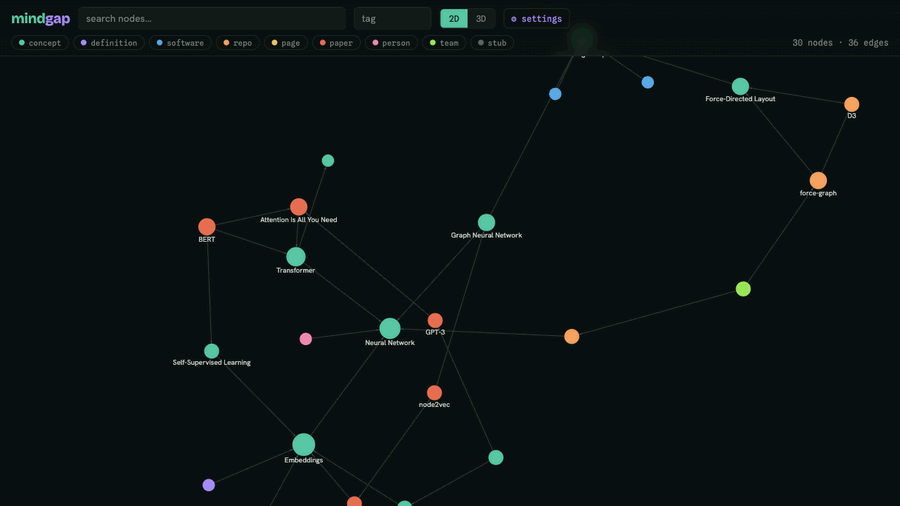
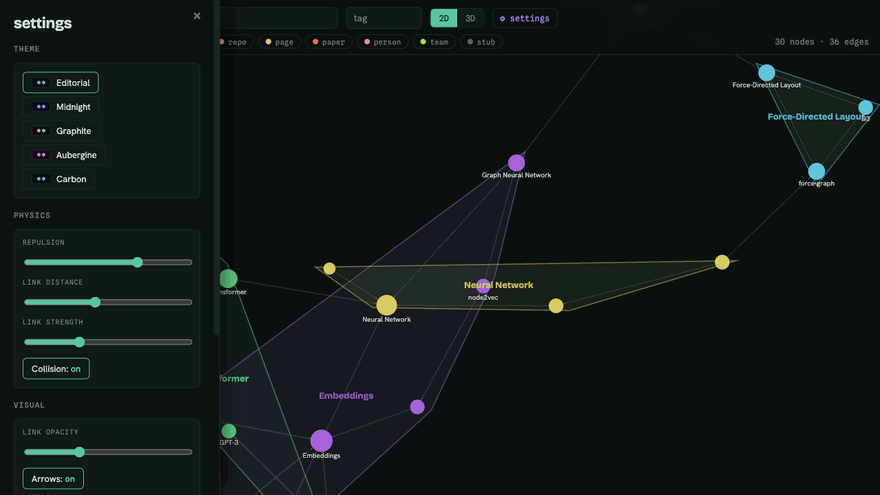
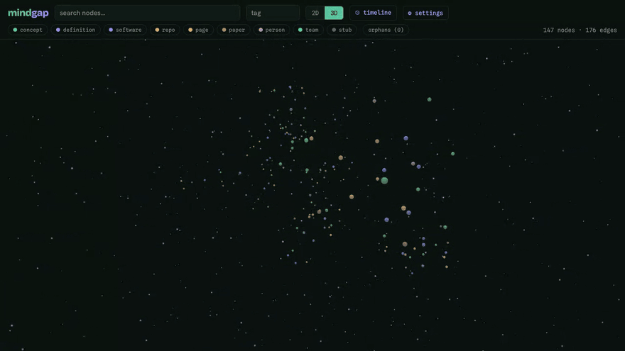
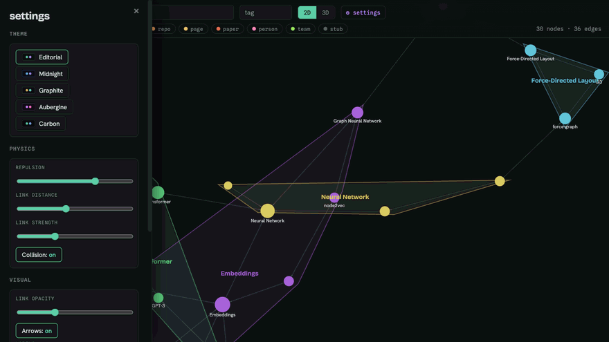

# mindgap

A local, org-roam-style knowledge graph for research and project knowledge: concepts, definitions, software, repos, Confluence pages, arXiv papers, people, teams. Nodes are markdown with `[[wiki-links]]` that auto-create edges; every node can carry outbound URLs. Curated by hand via CLI + web UI, and grown over time by autonomous agent loop sessions.

<p align="center"></p>

Stdlib-only Python 3.10 — no pip installs. Data lives in a single SQLite file.

## Install

Pick one. All paths put `mindgap` (and `mindgap-mcp`) on your PATH and store data in
`~/.mindgap` (override with `MINDGAP_HOME`, or `MINDGAP_DB` for just the DB file).

**pipx (recommended):**
    pipx install git+https://github.com/grburgess/mindgap.git
    mindgap init        # creates ~/.mindgap/mindgap.db and seeds it
    mindgap serve       # web UI at http://localhost:8765

**pip:**
    pip install --user git+https://github.com/grburgess/mindgap.git
    mindgap init && mindgap serve     # ensure ~/.local/bin is on PATH

**From a clone (no install / development):**
    git clone https://github.com/grburgess/mindgap.git && cd mindgap
    ./install.sh        # self-locating: PATH + ~/.mindgap + seed
    mindgap serve

### Claude Code plugin (skills + MCP)
    /plugin marketplace add grburgess/mindgap
    /plugin install mindgap
Registers the `mindgap` MCP server and the `paper-to-mindmap`, `arxiv-explainer`, `papers-library`, and `loop-system` skills.
(After a pip/pipx install, register the MCP directly with `claude mcp add mindgap mindgap-mcp`;
for a source checkout the repo's `.mcp.json` already points Claude Code at `./bin/mindgap-mcp`.)

### Where data lives
`~/.mindgap/` — `mindgap.db` and `snapshots/`. `MINDGAP_HOME` relocates the whole dir;
`MINDGAP_DB` points at a single DB file elsewhere.

## CLI cheatsheet

```
mindgap add --title T [--id ID] [--type TYPE] [--body MD | --body-file F]
            [--tags a,b] [--url KIND=URL ...] [--by AGENT]
mindgap link SRC DST [--rel REL] [--weight W] [--by AGENT]
mindgap ingest FILE|-                       # bulk JSON ('-' = stdin)
mindgap find QUERY [--type T] [--tag T] [--json]
mindgap show ID [--json]                    # node + neighbors + urls
mindgap context QUERY [--depth 1]           # markdown digest (for agents)
mindgap rm ID
mindgap unlink SRC DST [--rel REL]
mindgap export [--out FILE]                 # JSON snapshot -> ~/.mindgap/snapshots/
mindgap stats
mindgap serve [--port 8765] [--no-open]
```

## Web UI

`mindgap serve` opens a single-page graph viewer (dark editorial theme), in 2D or 3D:

- **Force layout** that spreads out instead of clumping — charge repulsion, a per-node collision force (2D), and tuned link distance keep nodes from overlapping, and the view auto-fits whenever the layout settles. Nodes are colored by type and sized by degree; hover a link to see its rel.
- **Settings drawer** (gear, top of the header) for live tuning, persisted to `localStorage`: a dark-theme picker (Editorial, Midnight, Graphite, Aubergine, Carbon), repulsion, link distance and strength, collision, link opacity, arrows, label mode, and the cluster controls below. "Reset to defaults" restores everything.
- **Cluster feedback.** Idea-communities are detected with multi-level Louvain — client-side, deterministic, no extra endpoint. Switch node coloring from *type* to *community* to surface them; in 2D each community also gets a translucent hull and a centroid label, and a legend (bottom-left) lists every community with its size — click one to isolate it and dim the rest. 3D conveys communities by color plus the legend. A **Topic repulsion** toggle adds a cohesion force that pulls each community toward its own centroid, so topics settle into spatially separate regions (works in 2D and 3D).
- **Labels** in four modes (off / hover / hubs / always). In *hubs* mode the most-connected nodes stay labelled and the rest fade in as you zoom into a region (2D); 3D shows a name on hover.
- **Search** box and **type/tag** filter chips narrow the graph live; a stats line sits in the header.
- Click a node → **sidebar** with its markdown body (wiki-links are clickable), tags, outbound URLs (open Confluence/GitHub/arXiv in a new tab), and neighbors. Edit body/tags/urls, link to another node via a search picker, or delete — all inline.
- **Focus mode** (double-click a node) shows its local 1-hop graph; clicking nodes, wiki-links, or neighbors while focused spreads the view ring by ring (org-roam style), and Esc or "unfocus" resets. Selecting any node flies the camera to it and highlights its neighborhood.

The UI is vanilla JS with no build step, drawing `force-graph`/`3d-force-graph`, `d3`, `marked`, and `dompurify` from CDNs. Community detection and hull geometry live in `web/cluster.js`. (3D node labels are intentionally omitted: a CDN `three` global can't be version-matched to the one `3d-force-graph` bundles, so 3D leans on color + legend + hover instead.)

## A tour of the UI

**Topic clusters (2D).** Color nodes by community, then flip on **Topic repulsion** — a cohesion force pulls each topic into its own region.



**3D mode.** The same graph in three dimensions — drag to orbit, scroll to zoom.



**Dark themes.** Five built-in dark themes — Editorial, Midnight, Graphite, Aubergine, Carbon — switched live.



## MCP server

For agents, `mindgap/mcp.py` exposes the graph as an [MCP](https://modelcontextprotocol.io) server over stdio — stdlib-only (newline-delimited JSON-RPC 2.0, no pip deps). Source checkouts: registered in [`.mcp.json`](.mcp.json) as `./bin/mindgap-mcp`. pip/pipx installs: `claude mcp add mindgap mindgap-mcp`.

Ten tools wrap the same `db` layer as the CLI: `mindgap_ingest` (batch write), `mindgap_add_node`, `mindgap_link`, `mindgap_unlink`, `mindgap_get_node`, `mindgap_find`, `mindgap_context`, `mindgap_stats`, `mindgap_export`, `mindgap_remove_node`. Unlike the raw CLI, the write tools validate at the call boundary — `mindgap_ingest` rejects the whole payload (no partial commit) if any edge endpoint isn't in the DB or the payload, `mindgap_link` refuses to auto-stub a missing endpoint, `created_by` is required, and writes return the persisted rows so a caller can't claim a write that didn't land.

## Agent loops

The graph is designed to be fed by recurring autonomous sessions that scan Confluence, GitHub, and arXiv. The protocol — read context first, ingest JSON with provenance (`created_by`, source URLs), wiki-link into the existing graph, export at session end — is defined in [AGENTS.md](AGENTS.md). Sessions can drive the graph via the CLI or the MCP tools above (the MCP's validation makes it the safer path for unattended writes).

## Knowledge loops (arXiv search → graph)

The bundle ships self-improving **loop templates** that sweep arXiv for a topic and ingest
findings into your graph with evidence-backed links — driven by the `loop-system` skill.

List what's available and scaffold one:
    mindgap loop list
    mindgap loop new arxiv-weekly --name my-watch --topics "your research area"

Then just tell Claude (in the project where you scaffolded it):
    "continue the my-watch loop"

Bundled templates:
- **arxiv-weekly** — recurring weekly 7-day arXiv sweep; tags every find, self-tunes its query
  strategy each pass. Schedule it unattended via the generated `CRON.md` (launchd/cron).
- **paper-discovery** — one-shot batch discovery of papers for a topic.
- **paper-links** — densify the graph by finding missing links between existing papers.
- **implementation-ideation** — mine the graph's growing connections for buildable ideas, then *adversarially refute* the infeasible ones; only vetted ideas (each with an MVP sketch) are ingested.
- **author-graph** — build a `person`-node graph of the researchers behind the work, with their *resolved* GitHub / homepage / Scholar links and co-author connections.

Share a loop you've built (strips your accumulated state):
    mindgap loop export my-watch              # -> ./my-watch-template/
    mindgap loop import ./my-watch-template --name their-watch --topics "..."

Prompts you can hand to Claude directly (once the plugin is installed):
- "set up an arxiv-weekly loop watching <your topics> and run the first pass"
- "continue the <name> loop"
- "export the <name> loop as a template I can share"
- "ideate implementations from the growing connections in my <name> graph, and refute the ones that aren't feasible" (implementation-ideation)
- "build a graph of the authors doing <your topics> work, with their github pages" (author-graph)

## Paper explainers

The bundled `arxiv-explainer` skill turns a paper into a richly animated, narrated HTML explainer — figures extracted from the PDF, a self-contained dark theme — and ingests it into your graph. Just tell Claude `explain <arXiv link>` (or point it at a local PDF).

## Import a Papers library

Mine your [Papers](https://www.papersapp.com/) (ReadCube) reference library into the graph: export it to BibTeX or RIS (Papers → Settings → Export) and tell Claude:

    "import my Papers library from <path-to-export.bib>"

The bundled `papers-library` skill parses the export (stdlib, no deps), ingests each paper as a node (deduped against the graph, evidence-linked), discovers related papers not yet in your library, and seeds ideas — handing off to the `paper-links` / `implementation-ideation` loops for depth.

## Schema overview

Two tables:

- `nodes(id, title, type, body, tags, urls, confidence, created_by, created_at, updated_at)` — id is a kebab-case slug; `tags`/`urls` are JSON arrays; types: `concept|definition|software|repo|page|paper|person|team|stub`.
- `edges(src, dst, rel, weight, created_by, created_at)` — rels: `relates_to|defines|implements|depends_on|cites|part_of|mentions`.

`[[wiki-links]]` in a body sync to `mentions` edges automatically, creating `stub` nodes for missing targets. Upserts merge: scalar fields replace, tags/urls union.

## Export & snapshots

The DB is gitignored; history is kept as JSON snapshots:

```
mindgap export                # ~/.mindgap/snapshots/<utc>.json
mindgap export --out my.json
```

Commit snapshots for a durable, diffable record; re-ingest one with `mindgap ingest FILE` to restore.

## Development

```
python3 -m mindgap ...                 # run CLI from repo without install
python3 -m unittest discover tests
```

## License

MIT — see [LICENSE](LICENSE).
